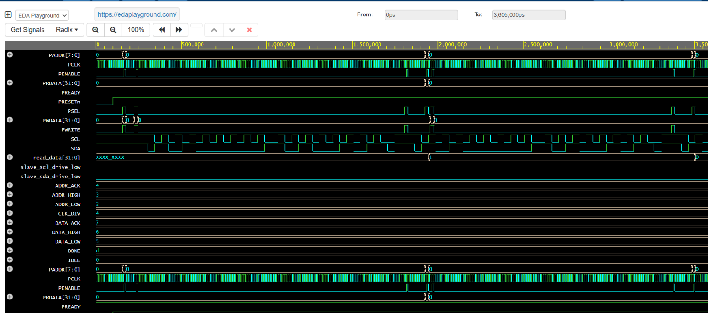

# I2C APB Master

## Project Overview

This project presents a Verilog RTL implementation of an I2C Master controller with an AMBA APB interface.

The APB interface is used for configuring the I2C Master and transferring control and data, while the I2C interface generates the required SCL and SDA signals for communication with an I2C slave device.

## Features

- Verilog RTL-based I2C Master
- APB interface for control and data transfer
- I2C Start and Stop condition generation
- I2C data transmission and reception
- ACK/NACK handling
- SCL and SDA signal generation
- RTL simulation and waveform verification

## Architecture

The design consists of two main interfaces:

### APB Interface
- PCLK
- PRESETn
- PSEL
- PENABLE
- PWRITE
- PADDR
- PWDATA
- PRDATA
- PREADY

### I2C Interface
- SCL
- SDA

The APB interface controls the I2C Master, which performs data communication through the I2C bus.

## Files

| File | Description |
|------|-------------|
| `i2c_apb_master.v` | Main Verilog RTL implementation of the I2C APB Master |
| `i2c_apb_master_tb.v` | Verilog testbench for functional verification |
| `simulation_waveform.png` | Simulation waveform obtained from EDA Playground |

## Simulation

The design was simulated using EDA Playground with a Verilog testbench.

The simulation verifies APB transactions and I2C communication signals including SCL, SDA, Start, Stop and ACK behavior.

## Simulation Result

## Tools Used

- Verilog HDL
- EDA Playground
- EPWave
- GitHub

## Applications

- I2C peripheral communication
- Sensor interfacing
- Embedded system communication
- Digital system and SoC design

## Author

**Hemalatha Chippada**

B.Tech – Electronics and Communication Engineering
